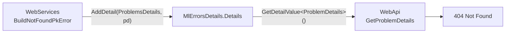

# MoralesLarios.OOFP.Shared

Proyecto **transversal de constantes compartidas** del ecosistema **MoralesLarios.FOOP**.

Su única razón de existir es evitar los *literales mágicos duplicados*: cuando dos o más
proyectos necesitan ponerse de acuerdo sobre una clave, un nombre o un identificador de texto,
esa constante vive aquí y no repetida en cada uno.

---

## Índice

1. [Por qué existe este proyecto](#1-por-qué-existe-este-proyecto)
2. [Contenido actual](#2-contenido-actual)
3. [`WebErrorDetailsKeys`](#3-weberrordetailskeys)
4. [Reglas de diseño del proyecto](#4-reglas-de-diseño-del-proyecto)
5. [Cómo añadir una constante nueva](#5-cómo-añadir-una-constante-nueva)
6. [Compatibilidad](#compatibilidad)

---

## 1. Por qué existe este proyecto

El caso que motivó su creación fue un bug real: el diccionario `Details` de `MlErrorsDetails`
se usaba como canal de transporte entre capas, pero **la clave se escribía a mano en cada
extremo**. Un proyecto guardaba el `ProblemDetails` bajo una clave y otro lo leía bajo otra,
de modo que el consumidor no encontraba nada y un **404 se degradaba silenciosamente a 500**.

El compilador no puede detectar ese tipo de error cuando la clave es un `string` literal
repetido. Sí puede detectarlo cuando es una **constante única y compartida**:

```csharp
// ❌ Antes: cada proyecto escribía su propio literal
details.AddDetail("NotFound", problemDetails);        // capa de servicios
var pd = details.GetDetailValue<ProblemDetails>();    // capa web buscaba "ProblemsDetails"

// ✅ Ahora: una sola fuente de verdad
details.AddDetail(WebErrorDetailsKeys.ProblemsDetails, problemDetails);
```

Además, este proyecto permite que dos proyectos compartan vocabulario **sin que uno tenga que
referenciar al otro**, evitando dependencias circulares o acoplamientos innecesarios entre,
por ejemplo, `MoralesLarios.OOFP.WebServices` y `MoralesLarios.OOFP.WebApi`.

---

## 2. Contenido actual

| Carpeta | Tipo | Contenido |
|---------|------|-----------|
| `Web/` | [`WebErrorDetailsKeys`](#3-weberrordetailskeys) | Claves del diccionario `Details` usadas en el flujo HTTP |

El proyecto es deliberadamente **mínimo**: `net8.0`, sin `PackageReference` y
**sin ningún `ProjectReference`**. Es la hoja del grafo de dependencias.

```text
MoralesLarios.OOFP.Shared/
├── MoralesLarios.OOFP.Shared.csproj   # net8.0, sin dependencias
└── Web/
    └── WebErrorDetailsKeys.cs         # claves de Details del flujo web
```

---

## 3. `WebErrorDetailsKeys`

Namespace: `MoralesLarios.OOFP.Shared.Web`

```csharp
public static class WebErrorDetailsKeys
{
    public const string ProblemsDetails = "ProblemsDetails";
}
```

| Constante | Valor | Para qué sirve |
|-----------|-------|----------------|
| `ProblemsDetails` | `"ProblemsDetails"` | Clave bajo la que se guarda en `MlErrorsDetails.Details` el `ProblemDetails` (RFC 7807) que la capa web debe devolver tal cual, preservando el código de estado HTTP original. |

### Quién la escribe y quién la lee



- **Escritura** — `MoralesLarios.OOFP.WebServices\Helpers\Extensions.cs`, al construir el error
  de «entidad no encontrada por clave primaria».
- **Lectura** — `MoralesLarios.OOFP.WebApi\Helpers\MlErrorsDetailsExtensions.cs`, al traducir un
  `MlResult` en fallo a un `IActionResult`.

> 🔑 **Regla:** nunca escribas el literal `"ProblemsDetails"` en tu código. Usa siempre la
> constante. Si aparece un literal, el enlace entre las dos capas puede romperse sin que el
> compilador avise.

---

## 4. Reglas de diseño del proyecto

1. **Cero dependencias.** Este proyecto no referencia a nadie. Cualquiera puede referenciarlo
   sin arrastrar transitivamente el núcleo, EF Core ni ASP.NET.
2. **Sólo constantes y contratos de texto.** No hay lógica, no hay estado, no hay servicios.
   Si necesitas comportamiento, ese código pertenece al proyecto que lo usa.
3. **`public const`, no `static readonly`.** Las claves son literales estables que interesa que
   se puedan usar en atributos, `switch` y expresiones constantes.
4. **Organización por dominio.** Una carpeta por área funcional (`Web/`, y las que vengan),
   con una clase estática por grupo cohesivo de constantes.
5. **Nombres descriptivos del *contrato*, no del *valor*.** `WebErrorDetailsKeys.ProblemsDetails`
   dice dónde se usa; `PROBLEMS_DETAILS` sólo repetiría el literal.
6. **Nunca cambies el valor de una constante publicada** sin tratarlo como *breaking change*:
   los consumidores compilados contra el valor antiguo seguirían usándolo (los `const` se
   incrustan en el ensamblado que los consume).

---

## 5. Cómo añadir una constante nueva

Antes de añadir algo aquí, comprueba que se cumplan **las tres condiciones**:

- [ ] El valor lo necesitan **dos o más proyectos** distintos.
- [ ] Un desacuerdo entre esos proyectos produciría un **bug silencioso** (no un error de compilación).
- [ ] El valor es un **literal estable**, no configuración que deba poder cambiarse en despliegue.

Si sólo lo usa un proyecto, la constante debe vivir en ese proyecto. Si es configurable, su
sitio es `appsettings.json` o las opciones fuertemente tipadas correspondientes.

Pasos:

1. Elige o crea la carpeta de dominio (`Web/`, `Data/`, …).
2. Añade la constante a la clase estática correspondiente, o crea una nueva clase
   `…Keys` / `…Names` si el grupo no existe.
3. Documenta la constante con XML docs indicando **quién la escribe y quién la lee**.
4. Añade la fila correspondiente a la tabla de este README.
5. Sustituye **todos** los literales existentes por la constante y ejecuta la suite de pruebas.

---

## Compatibilidad

- `.NET 8`

---

## Ver también

- 📘 [README general de la solución](../README.md)
- 📘 [README del núcleo `MoralesLarios.OOFP`](../MoralesLarios.FOOP/README.md)
- 📘 [MoralesLarios.OOFP.WebServices](../MoralesLarios.OOFP.WebServices/README.md) — productor de la clave
- 📘 [MoralesLarios.OOFP.WebApi](../MoralesLarios.OOFP.WebApi/README.md) — consumidor de la clave
- 📘 [Modelo de errores: `MlErrorsDetails` y su diccionario `Details`](../MoralesLarios.FOOP/__Doc/Types/MlResultErrors.md)
